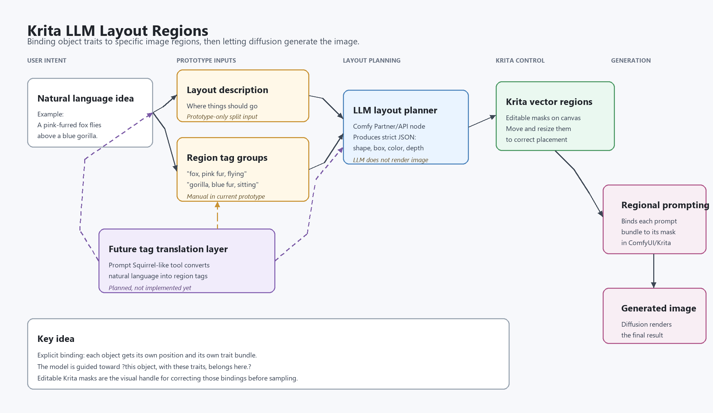

# Layout Squirrel

Automatically written prototype instructions. This is experimental code, and there is no guarantee that anything works exactly as described here.



Download the prototype Krita plugin zip:

[layout-squirrel-prototype-20260615.zip](release/layout-squirrel-prototype-20260615.zip)

## What It Does

- Layout Squirrel helps with prompts where position and traits need to stay attached to the right subject.
- Example problem: `pink squirrel on the left, blue deer on the right` often loses track of which subject should be pink, blue, left, or right.
- The user writes a natural-language layout note, such as `a brown rabbit and a blue deer sitting under a tree`.
- The user writes region tags, such as `"rabbit, brown fur", "deer, blue fur", tree`.
- An LLM turns those region tags into editable Krita vector regions.
- Krita AI Diffusion then uses those regions for regional prompting, so each region can carry its own prompt text.
- The user can move, resize, and recolor the generated shapes before generating the image.
- The current prototype still requires separate layout text and region tags. A more complete version should eventually derive region tags automatically from a natural-language prompt, possibly with a Prompt Squirrel-like tag translation step.

## Requirements

- Krita.
- Krita AI Diffusion / ComfyUI backend.
- ComfyUI Partner/API access for the LLM layout call.
- A compatible Stable Diffusion checkpoint and installed Krita AI Diffusion workload.
- An RGB/Alpha Krita document. Krita AI Diffusion rejects CMYKA documents.

## Basic Use

1. Start the ComfyUI backend and open Krita.
2. Create or open an RGB/Alpha document.
3. Open the AI Image Generation docker.
4. Enter the global/background prompt in the normal prompt field.
5. In the Layout Squirrel section, enter an optional layout description.
6. Enter region tags as comma-separated groups.
7. Use quotes around a region if its tag group contains commas, for example:

   ```text
   "fox, pink fur, flying", "gorilla, blue fur, sitting"
   ```

8. Click `Generate Layout`.
9. Move or resize the generated vector regions in Krita if needed.
10. Use `Region controls` to adjust individual region prompts, weights, feathering, and color hints.
11. Click the normal Krita AI Diffusion `Generate` button.

## Region Controls

- `Region`: the prompt text attached to that generated shape.
- `Weight`: per-region prompt weight. It defaults to `1.50x`. Higher values are applied by wrapping the region prompt with weighted prompt syntax before it is sent through the normal text-conditioning path.
- `Feather`: softens the regional text-conditioning mask boundary. It defaults to `100%`.
- `Color`: per-region latent color-hint strength. It defaults to `0.50`.
- Palette swatches: one to three color hints used for the region. The first swatch is also used as the visible shape color.
- `Color Mode`: `Latent` is the current default and most relevant prototype path.

## How Generation Works

- Region shapes are converted into masks.
- Each region prompt is applied through Krita AI Diffusion's regional conditioning path.
- The global/background prompt still applies to the full image.
- Layout Squirrel also generates a hidden color hint image from the region palettes.
- In `Latent` color mode, that color hint is projected into the latent image before sampling.
- Normal Comfy sampler noise is not replaced.
- At `Strength = 100%`, generation starts from an empty latent plus Layout Squirrel's color hint.
- At `Strength < 100%`, refine/img2img starts from the current canvas encoded into latent space, then applies the Layout Squirrel color hint before denoising.

Think of the color hint as a weak initial bias, not as paint. The visible vector region colors are not directly rendered into the final image.

## Refining An Existing Result

Displaying a generated image preview is not enough for refine/img2img.

To refine a generated result:

1. Click `Apply` on the generated result thumbnail.
2. Confirm the result appears as a normal layer in Krita's Layers panel.
3. Make that image layer visible with the eye icon.
4. Hide other normal image layers if you do not want them composited into the refine input.
5. Keep the Layout Squirrel region group available so the masks can still be read.
6. Set `Strength` below `100%`.
7. Press `Generate`.

Krita AI Diffusion captures the current document image by compositing visible normal image layers. It excludes internal AI preview layers, Layout Squirrel region layers, and control layers that are not part of the image.

## Debug Files

The prototype may write debug files in the Krita AI Diffusion user data directory:

- `layout_squirrel_debug.json`
- `layout_squirrel_latent_hint.png`
- `layout_squirrel_generation_attempts.jsonl`

These are meant for checking what the plugin sent to the backend and what hidden color-hint image was generated.

## Known Prototype Limits

- This is not a polished public release.
- The code is a patched/forked Krita AI Diffusion prototype, so upstream Krita AI Diffusion updates may break it.
- The LLM is only used for layout planning in this prototype.
- The layout description is not currently sent directly to Stable Diffusion.
- The region tags are the actual region prompts.
- Color hints are experimental and may behave unpredictably.
- Regional prompting is inherently fiddly; small regions, weak prompts, and model priors can still produce bad placement or wrong objects.
- The custom sampler-noise experiment was backed out because it made the output resemble colored noise instead of a generated image.
